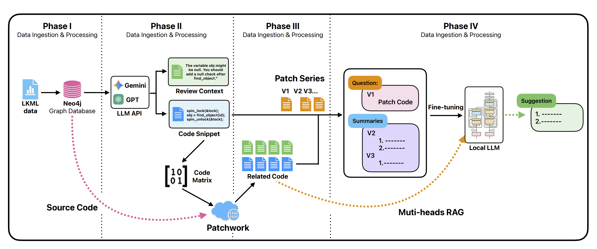

# LKML Thread Analysis: Dynamics, Role Modeling, and Summarization



This repository implements an end-to-end pipeline for analyzing Linux Kernel Mailing List (LKML) discussion threads. It is organized as four tasks built on top of a preprocessing stage that converts raw LKML JSON dumps into compact, analysis-friendly tables.

## What this project does

Given raw LKML thread data:

1.  **Preprocess / Compact the dataset**

      - Convert nested JSON threads into two flat tables:
          - **Event-level** (one row per thread)
          - **Message-level** (one row per email)

2.  **Task 1 — Discussion dynamics + topology clustering**

      - Characterize thread length and duration distributions
      - Build reply-graph features (depth, branching, etc.)
      - Cluster threads by topology (K-means) and analyze cluster properties

3.  **Task 2 — Text-based prediction**

      - **Task 2a:** Predict a message “role” (PATCH / REVIEW / ACK / OTHER) from text using supervision
      - **Task 2b:** Predict whether a thread becomes a *long debate* from the root email text only

4.  **Task 3 — Role-informed extractive summarization**

      - Generate structured extractive summaries using predicted roles + lightweight keyword heuristics

5.  **Task 4 — Distributed Processing & Advanced Pipelines**

      - **Distributed Merging:** Consolidate results from multiple worker nodes.
      - **Syzbot & Security Analysis:** specialized pipelines for automated bug reports and large-scale LLM security classification.

-----

## Expected data layout

The code assumes the raw LKML data is available locally in two directories:

  - `0_event_json_data/` — thread/event JSON files (each corresponds to one discussion thread)
  - `1_series_json_data/` — series JSON files (optional for Tasks 1–3; used for inspection / potential extensions)

Each event JSON is expected to contain (at minimum) thread metadata, a list of messages, and reply `connections`.

> If your raw data lives elsewhere, you may need to adjust the path constants in the scripts (see **Troubleshooting**).

-----

## Environment / dependencies

Python 3 is required. Typical dependencies used across the pipeline include:

  - `numpy`, `pandas`
  - `scikit-learn`
  - `matplotlib`
  - `joblib`
  - `tqdm` (if enabled in your environment)

If you run into import errors, install missing packages via:

```bash
pip install numpy pandas scikit-learn matplotlib joblib tqdm
```

-----

## Task 4 — Distributed Processing & Advanced Pipelines

This section details the advanced workflows for large-scale data processing, including environment setup for worker nodes, Syzbot integration, and distributed result merging.

### 4.1 Worker Node Environment Setup

Commands to configure a new GPU worker node (Ubuntu) with required proxies, Ollama, and Python environment.

```bash
# 1. System Updates & Tools
sudo apt update && sudo apt upgrade -y
sudo apt install curl tmux tsocks p7zip-full -y

# 2. Configure Network Proxy (Append to .bashrc)
cat <<EOT >> ~/.bashrc
export http_proxy="socks5://10.244.255.197:10808"
export https_proxy="socks5://10.244.255.197:10808"
export all_proxy="socks5://10.244.255.197:10808"
EOT
source ~/.bashrc

# 3. Install Ollama & Pull Model
curl -fsSL https://ollama.com/install.sh | sh
ollama pull gemma3:12b

# 4. Install Miniconda
curl -O https://repo.anaconda.com/miniconda/Miniconda3-latest-Linux-x86_64.sh
bash Miniconda3-latest-Linux-x86_64.sh -b -p $HOME/miniconda3
```

### 4.2 Core Data ETL Pipeline

The standard procedure to convert raw database dumps into grouped Series data for analysis.

1.  **DB to Event JSON:**
    ```bash
    python utils/dataset_to_event_json_v4.py \
      --db data/lkml-20250101-20250601.db \
      --out data/20250101-20250601/0_event_json_data \
      --batch-size 50000
    ```
2.  **Content Cleaning (Code Split):**
    ```bash
    python utils/split_code_from_content.py \
      --input data/20250101-20250601/0_event_json_data \
      --output data/20250101-20250601/depart_jsondata
    ```
3.  **Merge Messages:**
    ```bash
    python utils/merge_event_messages_by_code.py \
      --input data/20250101-20250601/depart_jsondata \
      --output data/20250101-20250601/mergedata
    ```
4.  **Series Grouping (Versioning):**
    ```bash
    python utils/group_event_to_series_v2.py \
      --input data/20250101-20250601/0_event_json_data \
      --output data/20250101-20250601/1_series_json_data
    ```

### 4.3 Specialized Workflows

#### A. Syzbot Analysis Pipeline

Pipeline to isolate and analyze automated bug reports from Syzbot.

```bash
# Filter Syzbot events
python utils/filter_syzbot_events.py \
    --input_dir ./data/20250101-20250601/0_event_json_data \
    --output_dir ./data/20250101-20250601/0_syzbot_event_json_data

# Group Syzbot series
python utils/filter_syzbot_series_v2.py \
    --series_dir /mnt/d/Haku/Downloads/2015-2025-LKML/1_series_json_data \
    --events_dir /mnt/d/Haku/Downloads/2015-2025-LKML/0_event_json_data \
    --output_dir /mnt/d/Haku/Downloads/2015-2025-LKML/3_syzbot_related
```

#### B. Patchwork Integration

Match local series with upstream Patchwork data using LLM.

```bash
python utils/find_patch_series_patchwork_v3.py \
    --series_dir ./data/20250101-20250601/1_series_json_data \
    --events_dir ./data/20250101-20250601/0_event_json_data \
    --output_dir ./data/20250101-20250601/2_series_archived \
    --ollama_model gemma3:12b \
    --token YOUR_TOKEN \
    --concurrency 2
```

#### C. Security Classification (Batched)

Run LLM-based security filtering on large datasets in chunks.

```bash
# Example: Process 0-90k
python utils/security_filter_series_v2.py \
    --series_dir ./data/all/1_series_json_data \
    --events_dir ./data/all/0_event_json_data \
    --output_dir ./data/all/3_classified_series \
    --ollama_model gemma3:12b \
    --start_index 0 --end_index 90000
```

### 4.4 Distributed Merging

Merge processed data chunks from multiple worker nodes (e.g., `m1` to `m5`) into a final dataset.

```bash
python utils/merge_distributed_results_mt.py \
    --inputs \
        /mnt/d/Haku/Downloads/data/m1 \
        /mnt/d/Haku/Downloads/data/m2 \
        /mnt/d/Haku/Downloads/data/m3 \
        /mnt/d/Haku/Downloads/data/m4 \
        /mnt/d/Haku/Downloads/data/m5 \
    --output ./data/final \
    --workers 16

# Archive final result
7z a -mmt data_usa4.7z ./data
```
